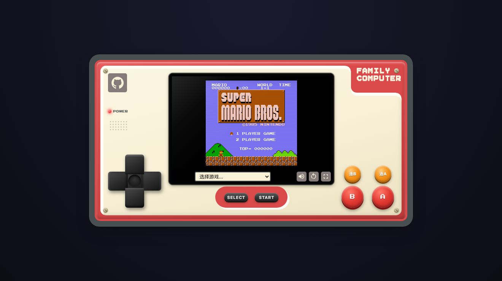

# 红白机 FC

[](https://github.com/ElpsyCN/fc/actions/workflows/gh-pages.yml)

> 预览地址: <https://fc.elpsy.cn>
> 开发版预览: <https://fc.yunyoujun.cn>

使用 Vue 3 + Vite + TypeScript 重构的在线 FC/NES 模拟器，重构自 [dafeiyu/jsnes](https://gitee.com/feiyu22/jsnes)。

ROM 基于 [JSNES](https://github.com/bfirsh/jsnes) 运行。



## 技术栈

- Vue 3（`<script setup>` + 组合式 API）
- Vite + TypeScript
- Vitest + @vue/test-utils（单元 / 组件测试）
- ESLint（[@antfu/eslint-config](https://github.com/antfu/eslint-config)）

## Usage

```bash
# 安装依赖
pnpm i

# 启动开发服务器 http://localhost:5173
pnpm dev

# 构建生产产物
pnpm build

# 运行测试
pnpm test

# 代码检查 / 自动修复
pnpm lint
pnpm lint:fix
```

### 按键

| 游戏按键 | 玩家 1（键盘）   | 玩家 2（键盘） |
| -------- | ---------------- | ------------- |
| 上下左右 | 方向键           | I / K / J / L |
| A        | <kbd>A</kbd>     | <kbd>H</kbd>  |
| B        | <kbd>S</kbd>     | <kbd>G</kbd>  |
| SELECT   | <kbd>Space</kbd> | <kbd>T</kbd>  |
| START    | <kbd>Enter</kbd> | <kbd>Y</kbd>  |

移动端可直接触摸手柄按键，并支持 TURBO 连发键。

## Features

- **拟真红白机外观**：黑色立体十字键、红色 A/B、橙色 TURBO 连发键、立体 SELECT/START、电源指示灯、机身螺丝、扬声器格栅
- **CRT 屏幕**：扫描线、玻璃高光、像素级（`pixelated`）渲染、开机点亮动画
- **AudioWorklet 音频**：在独立线程输出，避免占用主线程导致卡顿
- **实用功能**：全屏、静音、重置、游戏存档 / 读档（按 ROM 区分，存于本地）
- **双人对战**：支持玩家 1 / 玩家 2 键盘
- 像素字体（Press Start 2P）、跟随系统的暗色模式（`prefers-color-scheme`）
- PC + 移动端响应式布局与触摸优化
- 无障碍：键盘焦点可见、`aria-label` 标签、尊重 `prefers-reduced-motion`
- **PWA**：可添加到主屏幕、离线可安装，缓存玩过的游戏离线重玩
- 全部组件采用 Vue 3 `<script setup>`

## Todo

- [ ] 手柄按键自定义
- [ ] 更多游戏 ROM
