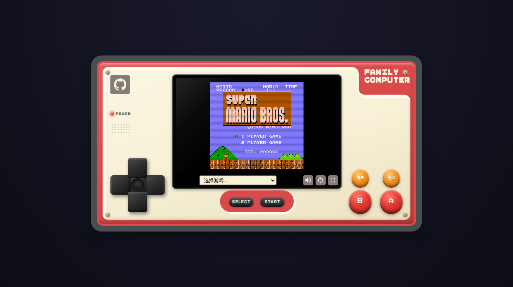

# 红白机 FC

[](https://github.com/YunLeFun/fc/actions/workflows/ci.yml)

> 线上地址: <https://fc.yunle.fun>
> 兼容域名: <https://fc.elpsy.cn>
> 开发版预览: <https://fc.yunyoujun.cn>

使用 Vue 3 + Vite + TypeScript 重构的在线 FC/NES 模拟器，重构自 [dafeiyu/jsnes](https://gitee.com/feiyu22/jsnes)。

ROM 基于 [JSNES](https://github.com/bfirsh/jsnes) 运行。



## 技术栈

- Vue 3（`<script setup>` + 组合式 API）
- Vite + TypeScript
- Vitest + @vue/test-utils（单元 / 组件测试）
- ESLint（[@antfu/eslint-config](https://github.com/antfu/eslint-config)）

## Usage

```bash
# 安装依赖
pnpm i

# 启动开发服务器 http://localhost:5173
pnpm dev

# 构建生产产物
pnpm build

# 运行测试
pnpm test

# 代码检查 / 自动修复
pnpm lint
pnpm lint:fix
```

### 按键

| 游戏按键 | 玩家 1（键盘）   | 玩家 2（键盘） |
| -------- | ---------------- | ------------- |
| 上下左右 | 方向键           | I / K / J / L |
| A        | <kbd>A</kbd>     | <kbd>H</kbd>  |
| B        | <kbd>S</kbd>     | <kbd>G</kbd>  |
| SELECT   | <kbd>Space</kbd> | <kbd>T</kbd>  |
| START    | <kbd>Enter</kbd> | <kbd>Y</kbd>  |

移动端可直接触摸手柄按键，并支持 TURBO 连发键。

## Features

- **拟真红白机外观**：黑色立体十字键、红色 A/B、橙色 TURBO 连发键、立体 SELECT/START、电源指示灯、机身螺丝、扬声器格栅
- **CRT 屏幕**：扫描线、玻璃高光、像素级（`pixelated`）渲染、开机点亮动画
- **AudioWorklet 音频**：在独立线程输出，避免占用主线程导致卡顿
- **实用功能**：全屏、静音、重置、游戏存档 / 读档（按 ROM 区分，存于本地）
- **双人对战**：支持玩家 1 / 玩家 2 键盘
- 像素字体（Press Start 2P）、跟随系统的暗色模式（`prefers-color-scheme`）
- PC + 移动端响应式布局与触摸优化
- 无障碍：键盘焦点可见、`aria-label` 标签、尊重 `prefers-reduced-motion`
- **PWA**：可添加到主屏幕、离线可安装，缓存玩过的游戏离线重玩
- **云乐坊账号**：接入 [`@yunlefun/sso`](https://www.npmjs.com/package/@yunlefun/sso) 跨站登录，会员可云端同步游戏存档（跨设备）
- 全部组件采用 Vue 3 `<script setup>`

## 云乐坊账号接入

前端由 EdgeOne Makers（原 EdgeOne Pages）连接 Git 仓库构建并静态托管。登录使用 [`@yunlefun/sso`](https://www.npmjs.com/package/@yunlefun/sso) v3 顶层 Redirect + PKCE；CloudBase Auth 只在授权回跳时以 `persistence: 'none'` 临时加载，长期登录态由同源 `/api` 的 HttpOnly Cookie 管理。

同仓库的 EdgeOne Node.js Cloud Function 仅代理站点同源 `/api/*` 到 CloudBase HTTP Function；选用 Node.js 运行时是因为云存档请求体可达约 1.5 MB，超过 Edge Function 的 1 MB 上限。会员校验、存档上限和数据权限均在 CloudBase BFF 执行，普通访问不会加载 CloudBase 浏览器 SDK。

前端可用环境变量：

| 环境变量 | 说明 | 默认 |
| --- | --- | --- |
| `VITE_CLOUDBASE_ENV` | CloudBase 环境 ID | `yunlefun-8g7ybcxc7345c490` |
| `VITE_CLOUDBASE_KEY` | publishable key（可选） | 空 |
| `VITE_YLF_SSO_CLIENT_ID` | SSO Client Registry 标识 | `fc-web` |
| `VITE_FC_API_BASE` | 同源 BFF 路径 | `/api` |
| `VITE_FC_MAX_SAVES` | 云存档总数上限 | `20` |

CloudBase Function 运行时配置：

| 环境变量 | 说明 | 默认 |
| --- | --- | --- |
| `CLOUDBASE_ENV_ID` | 身份双证明校验使用的环境 ID | `yunlefun-8g7ybcxc7345c490` |
| `FC_ALLOWED_ORIGINS` | Cookie 接口允许的精确 Origin（逗号分隔） | `https://fc.yunle.fun,https://fc.elpsy.cn` |
| `FC_MAX_CLOUD_SAVES` | 服务端强制的每用户存档上限 | `20` |
| `FC_SESSION_CSRF_SECRET` | session-bound CSRF 密钥，至少 32 字符 | 无，必须通过函数环境 Secret 注入 |

部署资源要求：

- SSO Client Registry 注册 `fc-web`，精确绑定 `https://fc.yunle.fun/` 与 `https://fc.elpsy.cn/`。
- `ylf_app_sessions`、`fc_saves`、`fc_save_quotas` 均为 server-only；`fc_saves` 需要 `userId + updatedAt(desc)` 复合索引。`fc_save_quotas` 每个用户只有一条计数记录，用于在事务中严格阻止并发请求突破 20 个存档上限。
- `fc-api` 使用 CloudBase `Nodejs20.19` HTTP Function，`scf_bootstrap` 监听端口 `9000`。
- EdgeOne Makers 连接本 Git 仓库，按 `edgeone.json` 使用 Node.js 22、pnpm 10 构建 `dist`。
- `cloud-functions/api/[[default]].js` 将同源 `/api/*` 代理到 `https://api.yunle.fun/fc-api`；可通过 EdgeOne 环境变量 `FC_API_UPSTREAM_URL` 覆盖。
- EdgeOne 预览域名只验证静态资源、Functions 构建和 `/api/health`；SSO 回跳与 unsafe API 强制精确生产 Origin，因此完整登录/云存档验证应在上游就绪后切换 `fc.yunle.fun` 与 `fc.elpsy.cn`，并保留 DNS 回滚方案。

本地构建 CloudBase Function 部署目录：

```bash
pnpm build:function
```

完整联调由 EdgeOne CLI 同时启动 Vite 与 Functions（CLI 会读取现有的 `pnpm dev`，不要把 `edgeone makers dev` 配置成项目的 `dev` 命令）：

```bash
PAGES_SOURCE=skills edgeone pages dev
```

新版 CLI 也可使用等价的 `edgeone makers dev` 命令。

## PWA 开关

PWA 默认开启。如需关闭，在构建环境中设置 `VITE_PWA_ENABLED=false`。关闭构建仍会发布一个自注销 Service Worker，用于解除旧版本的控制并清理已有缓存：

```bash
VITE_PWA_ENABLED=false pnpm build
```

## Todo

- [ ] 手柄按键自定义
- [ ] 更多游戏 ROM
